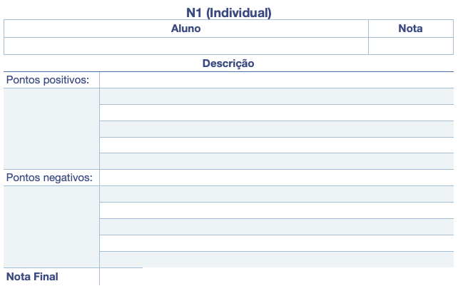

# Unidade 1  

Introdução a sistemas gráficos: histórico e aplicações, conceitos gerais, principais áreas da Comp. Gráfica, dispositivos de entrada e saída gráficos, e introdução a biblioteca gráfica (OpenGL/OpenTK).  

Objetivo: identificar os conceitos gerais da Computação Gráfica e as principais áreas de atuação.  

## Material  

[cg-slides_u1.pdf](./cg-slides_u1.pdf "cg-slides_u1.pdf")  

## Atividades  

Os assuntos serão sorteados pelo professor e enviados para cada equipe, então não esqueça de definir sua equipe no AVA3.

O que deve ser feito:

- prepare uma apresentação de no máximo 10 minutos
- escolha a melhor forma de apresentar o conteúdo usando slides, animações, vídeos, exemplos práticos, etc.
- em caso de dúvida, converse com o professor.

## Gabarito

  

----------

### ⏭ [Unidade 2)](../Unidade2/README.md "Unidade 2")  

<!--
[FIXME: arrumar as fontes bibliográficas]  
## Principais Referências Bibliográficas​
-->